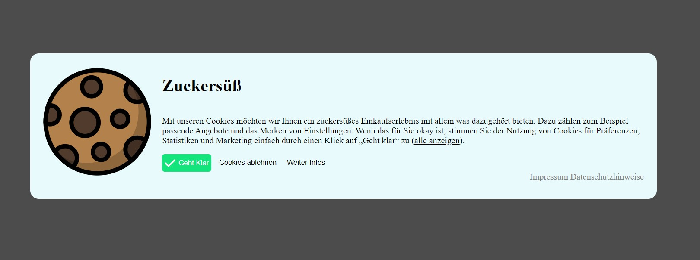

# German Cookie Banner

## Description
This is simple cookie banner for german websites.

## Requirements
The banner is based on HTML, CSS and JavaScript.

# How it works
The `getCookie()` function is used to check if the user has a **cookiesConsent** cookie. This is cookie is referred to as the `cookieMain`. Its presence tells us, that the user has already selected a cookie choice and thus will no longer see the banner.

If the **cookiesConsent** cookie is not present, the `hidden` class is removed from the `cookies-container` and we see our cookie banner:

A click on the button `Geht Klar` will create two new cookies: 
- **cookiesConsentAll=true** (indicates the user has accepted all cookies)
- **cookiesMain** (indicates the user has selected a choice and will no longer see the banner)

A click on the button `Cookies ablehnen` will create two new cookies: 
- **cookiesConsentAll=false** (indicates the user has declined all cookies)
- **cookiesMain** (indicates the user has selected a choice and will no longer see the banner)

A click on the button `Weitere Infos` will lead to a new window: 

A click on the button `Alle aktivieren` will create two new cookies: 
- **cookiesConsentAll=true** (indicates the user has accepted all cookies)
- **cookiesMain** (indicates the user has selected a choice and will no longer see the banner)

Without any selection, clicking on the button `Gewählte Cookies erlauben` will create two new cookies:
- **cookiesMandatory=true** (indicates the user has accepted all mandatory cookies)
- **cookiesMain** (indicates the user has selected a choice and will no longer see the banner)

The indivdual selectable cookies can be changed in `index.html`:

The `cookieScript.js` checks whether the checkbox attribute `checked` is true or false for each `input` element within the `section` with the id=`cookie-setting`.
If it is true, the specific cookie will be set.

In the given example, checking and clicking the button `Gewählte Cookies erlauben` will lead to the creation of two cookies:
- **cookiesMandatory=true** (indicates the user has accepted all mandatory cookies)
- **cookiesMain** (indicates the user has selected a choice and will no longer see the banner)

Depending on the user choice the cookies that also will be generated are:
- **cookiesConsentAuto** (indicates the user has selected the **Auto**-Choice)
- **cookiesConsentChat** (indicates the user has selected the **Chat**-Choice)

(Note: The Cookie names are auto generated based on the `name` attribute of their `input` field.)

# Sources
- The starting point for this banner came from [here](https://monsterlessons-academy.com/posts/cookie-consent-popup-cookie-banner-examples-with-html-css-javascript).
- The small check icon is from [Font Awesome](https://fontawesome.com/icons/check?f=classic&s=solid)
- The cookie icon is from [Stockio](https://www.stockio.com/free-icon/christmas-icons-cookie)
