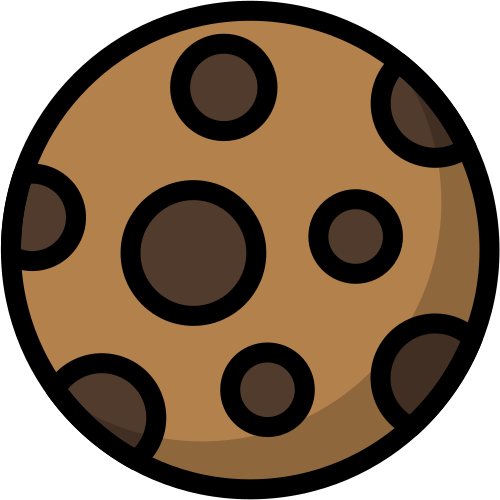
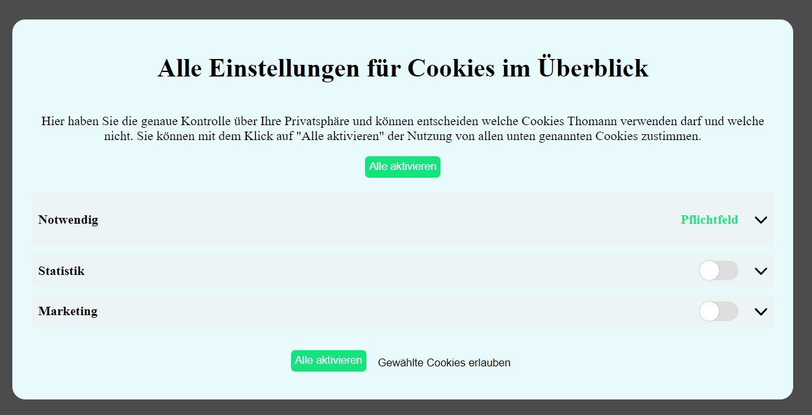

# German Cookie Banner

## Description
This is a simple cookie banner for german websites that is injected via JavaScript, if the user has not yet seen the banner or selected a cookie choice. 

If the cookie `cookieBanner` is present, the banner will not be injected and thus keep your DOM clean.

The banner is usable with the [Google Tag Manager](#integration-with-google-tag-manager).

## Requirements
The banner is based on HTML, CSS and JavaScript.

To include it in your page you will need to:
1. link the stylesheet in your header

```
<link rel="stylesheet" href="./cookieStyle.css">
```

2. Include the script at the end of the body's tag
```
<body>
    <script src="./cookieScript.js"></script>
</body>
```

3. Make sure to either adjust the path to `cookie.svg` in the injected HTML banner or define a path to your own image

```

```

You should include both on all of your pages.

# How it works
The `getCookie()` function is used to check if the user has a **cookiesConsent** cookie. This is cookie is referred to as the `cookieBanner`. Its presence tells us, that the user has already selected a cookie choice and thus will no longer see the banner.

If the **cookiesBanner** cookie is not present, the ``createBanner()`` function is called and it injects our cookie banner:


A click on the button `Geht Klar` will create two new cookies: 
- **cookiesConsentAll=true** (indicates the user has accepted all cookies)
- **cookieBanner** (indicates the user has selected a choice and will no longer see the banner)

A click on the button `Cookies ablehnen` will create two new cookies: 
- **cookiesConsentAll=false** (indicates the user has declined all cookies)
- **cookieBanner** (indicates the user has selected a choice and will no longer see the banner)

A click on the button `Weitere Infos` will lead to a new window: 


A click on the button `Alle aktivieren` will create two new cookies: 
- **cookiesConsentAll=true** (indicates the user has accepted all cookies)
- **cookieBanner** (indicates the user has selected a choice and will no longer see the banner)

Without any selection, clicking on the button `Gewählte Cookies erlauben` will create two new cookies:
- **cookiesMandatory=true** (indicates the user has accepted all mandatory cookies)
- **cookieBanner** (indicates the user has selected a choice and will no longer see the banner)

The indivdual selectable cookies can be changed in the `createBanner()` function:

The `cookieScript.js` checks whether the checkbox attribute `checked` is true or false for each `input` element within the `section` with the id=`cookie-setting`.
If it is true, the specific cookie will be set.

In the given example, checking and clicking the button `Gewählte Cookies erlauben` will lead to the creation of two cookies:
- **cookiesMandatory=true** (indicates the user has accepted all mandatory cookies)
- **cookieBanner** (indicates the user has selected a choice and will no longer see the banner)

Depending on the user choice the cookies that also will be generated are:
- **cookiesConsentStatistics** (indicates the user has selected the **Statistics**-Choice)
- **cookiesConsentMarketing** (indicates the user has selected the **Marketing**-Choice)

(Note: The Cookie names are auto generated based on the `name` attribute of their `input` field.)

# Integration with Google Tag Manager

The cookie banner works with the Googel Tag Manager.

There are two choices of integrating it:
1. Using a custom (First-Party-Cookie) variable
    - Variable type: First-Party-Cookie
    - Cookie Name: 
        - 'cookiesConsentAll'
        - 'cookiesConsent' + `cookieSuffix` (The cookieSuffix is based on the `name` attribute of the cookie choice button in `index.html`)
2. Using a custom (data layer) variable
    - Variable type (German: 'Datenschichtvariable'): Data Layer Variable
    - Data Layer Variable Name: 
        - 'cookiesConsentAll'
        - 'cookiesConsent' + `cookieSuffix` (The cookieSuffix is based on the `name` attribute of the cookie choice button in `index.html`)
    - Data Layer Version (German: Datenschichtversion): Version 2 

# Note on Styling

Although I have tried to make them as specific as possible, please ensure that no CSS identifier in `cookieScript.js` clashes with your own identifiers.


# Sources
- The starting point for this banner came from [here](https://monsterlessons-academy.com/posts/cookie-consent-popup-cookie-banner-examples-with-html-css-javascript).
- The small check icon is from [Font Awesome](https://fontawesome.com/icons/check?f=classic&s=solid)
- The cookie icon is from [Stockio](https://www.stockio.com/free-icon/christmas-icons-cookie)
